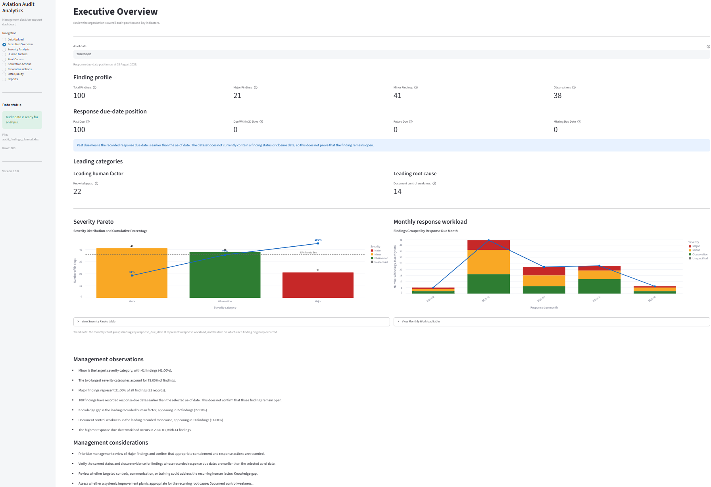
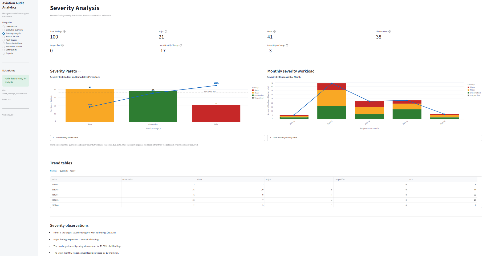
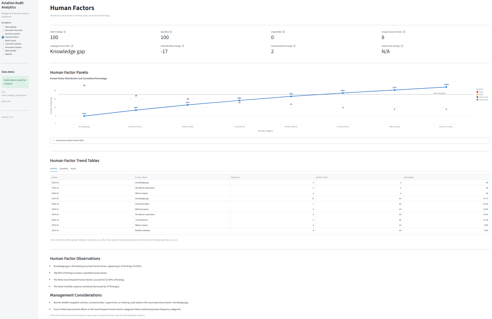
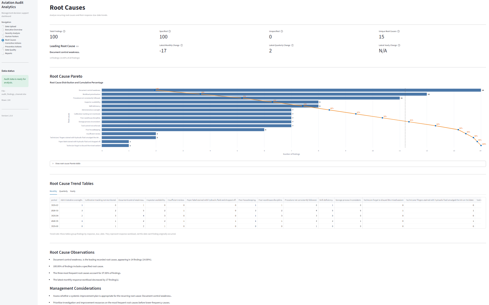
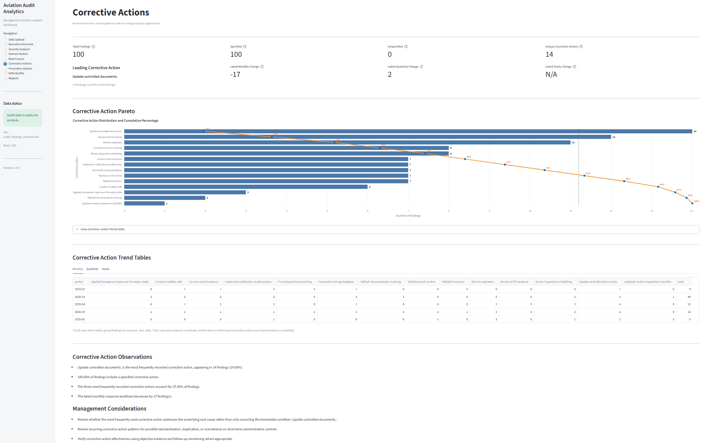
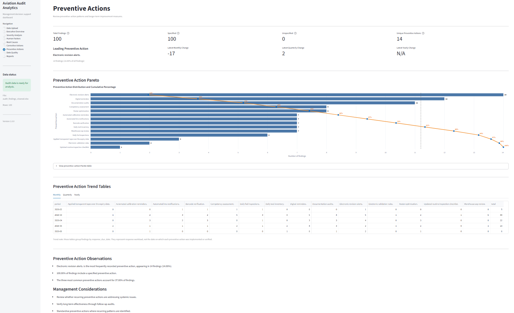
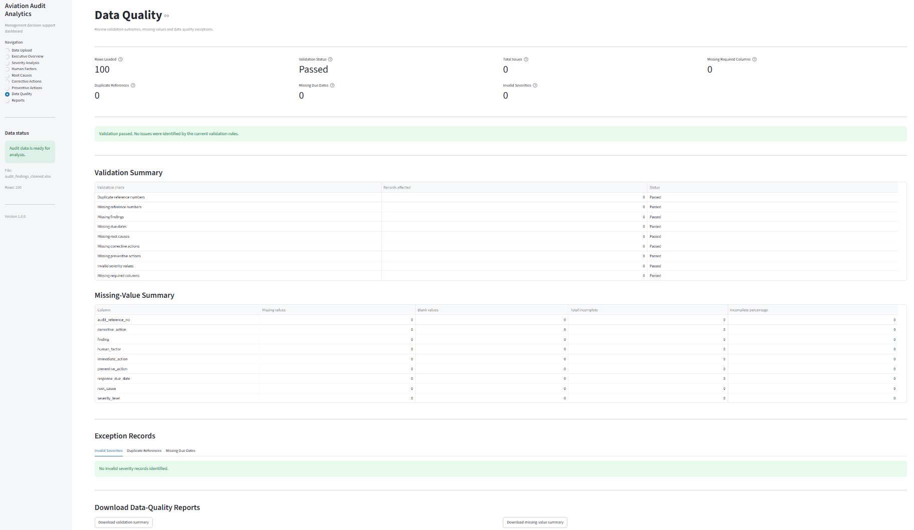
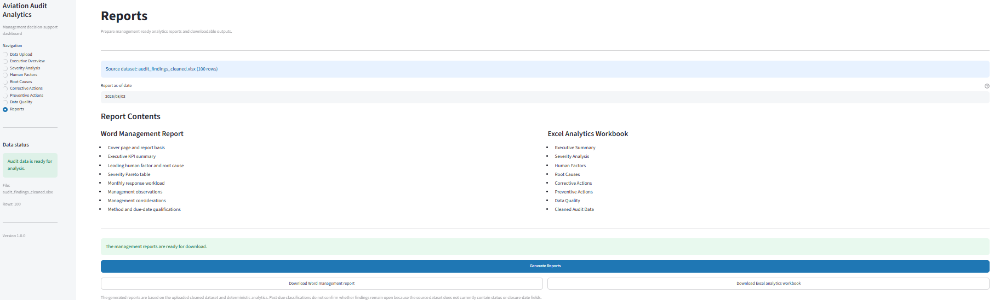

# Aviation Audit Analytics Dashboard

A production-ready Python and Streamlit dashboard for analysing Aviation Maintenance, Repair and Overhaul (MRO) audit findings through executive analytics, automated data validation, Pareto analysis, trend analysis, and downloadable management reports.

---

## Overview

Aviation Audit Analytics helps Aviation Maintenance, Repair and Overhaul (MRO) quality assurance and compliance monitoring teams transform audit findings into actionable management insights through interactive dashboards and automated reporting.

The application enables users to:

- Upload audit findings from Microsoft Excel.
- Perform automated data validation and quality checks.
- Analyse severity distributions using Pareto analysis.
- Identify recurring human factors.
- Detect common root causes.
- Review corrective and preventive actions.
- Monitor monthly response workloads.
- Generate executive management dashboards.
- Export professional Microsoft Word reports.
- Export Microsoft Excel analytics workbooks.

---

## Key Features

### Executive Analytics
- Executive KPI dashboard
- Monthly workload analysis
- Deterministic management observations

### Operational Analytics
- Severity Pareto analysis
- Human factor analysis
- Root cause analysis
- Corrective action analysis
- Preventive action analysis

### Data Quality
- Automated validation engine
- Data quality dashboard

### Reporting

- Microsoft Word management report generation
- Microsoft Excel analytics workbook generation
- Download-ready reports directly from the dashboard

---

# Architecture

```text
                                 Excel Audit Register
                                          │
                                          ▼
                           Data Loading & Cleaning
                                          │
                                          ▼
                            Data Validation Engine
                                          │
                                          ▼
                                Analytics Engines
      ┌─────────────┬─────────────┬─────────────┬─────────────┬─────────────┐
      ▼             ▼             ▼             ▼             ▼
 Executive KPI    Severity      Human        Root         Corrective
 Dashboard        Analysis      Factors      Causes       Actions
                                 Analysis     Analysis
      └─────────────┴─────────────┴─────────────┴─────────────┘
                                          │
                                          ▼
                              Preventive Actions
                                          │
                                          ▼
                            Data Quality Dashboard
                                          │
                                          ▼
                       Streamlit Management Dashboard
                                          │
                       ┌──────────────────┴──────────────────┐
                       ▼                                     ▼
          Word Management Report          Excel Analytics Workbook
```

---

## Executive Dashboard



The executive dashboard provides an overall summary of audit findings, KPI metrics, response due-date status, leading categories, Pareto analysis, monthly workload trends, and management observations.

---

## Severity Analysis



Analyse the distribution of audit findings by severity using Pareto analysis, monthly trends and detailed trend tables.

---

## Human Factor Analysis



Identify recurring human factors, monitor monthly trends and determine the most common contributors to audit findings.

---

## Root Cause Analysis



Identify recurring root causes and monitor trends to support preventive quality improvement initiatives.

---

## Corrective Action Analysis



Review corrective action categories, trends and Pareto distributions to monitor organisational response effectiveness.

---

## Preventive Action Analysis



Analyse preventive actions, identify recurring themes and monitor long-term improvement activities.

---

## Data Quality Dashboard



Validate uploaded audit registers, identify missing information and ensure data integrity before analysis.

---

## Reports



Generate professional Microsoft Word management reports and Microsoft Excel analytics workbooks directly from the dashboard.

---

# Technology Stack

| Category | Technology |
|----------|------------|
| Programming Language | Python 3.11 |
| Front-end | Streamlit |
| Data Processing | Pandas |
| Visualisation | Altair |
| Excel Processing | OpenPyXL |
| Word Report Generation | python-docx |
| Static Type Checking | MyPy |
| Linting & Formatting | Ruff |
| Testing | Pytest |
| Version Control | Git & GitHub |
| Continuous Integration | GitHub Actions |


---

# Installation

## Clone the repository

```bash
git clone https://github.com/victorix41/aviation-audit-analysis.git
cd aviation-audit-analysis
```

## Create the environment

```bash
conda create -n audit-ai python=3.11
conda activate audit-ai
```

## Install dependencies

```bash
pip install -r requirements.txt
```

---

# Running the Application

Start the Streamlit dashboard:

```bash
streamlit run app.py
```

The application opens automatically in your default web browser.


---

# Project Structure

```text
aviation-audit-analysis/
│
├── app.py
├── docs/
├── outputs/
├── src/
│   ├── analytics/
│   ├── models/
│   ├── reports/
│   └── ui/
├── tests/
├── README.md
├── requirements.txt
└── LICENSE
```

---

# Code Quality

The project maintains production-quality coding standards through:

- Ruff formatting
- Ruff linting
- MyPy static type checking
- Pytest automated testing
- GitHub Actions continuous integration

Current status:

- ✅ 162 automated tests passing
- ✅ Ruff formatting
- ✅ Ruff linting
- ✅ MyPy type checking
- ✅ GitHub Actions CI


---

# License

This project is released under the MIT License.

See the LICENSE file for details.


---


## Project Status

Phase 1 – Environment Setup ✅